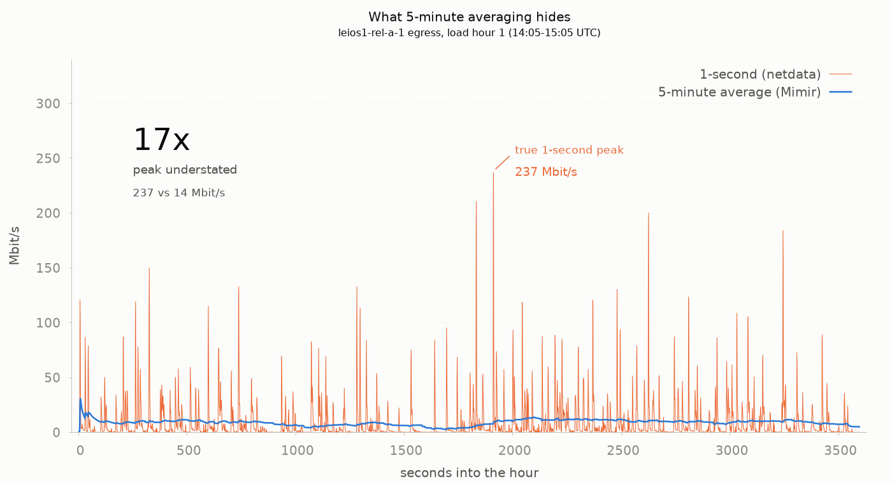
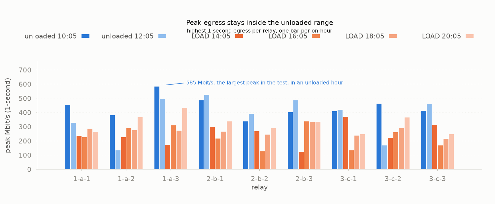
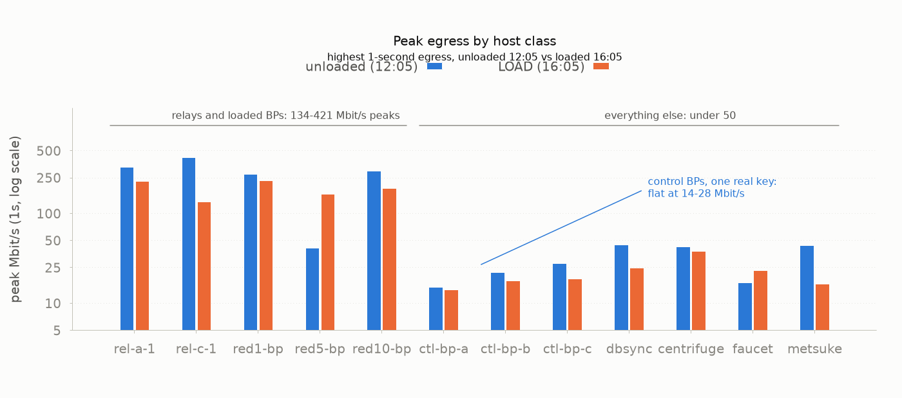

# Leios vote load test — results

**Date:** 2026-10-09. All times UTC.
**Coverage:** Mimir metrics for four load hours against five phase-aligned baseline
on-hours, plus 1-second netdata for three load hours and two baselines across 19 hosts.
The 1-second archive does not yet include load hour 4 (20:05–21:05).

## What was tested

750 synthetic pools (`lt001`–`lt750`) were registered against the leios network and their
BLS keys merged into 76-key arrays on the ten `leiosred*-bp-*` block producers. The chain
sits at 900 live pools, exactly the CIP-0164 committee cap. The synthetic seats hold
negligible stake, so they add vote *volume* without adding vote *weight*.

Keys were deployed at ~14:02. The three `leios[1-3]-bp-*` hosts were left untouched with a
single real key each. They are the control group and the most useful instrument in the test.

**Node build: Leios prototype w40a.** The nine relays run the governor-patched variant
(`node-leios-patched`); every other host runs plain `node-leios`. Every number in this
document is specific to that build. w40a carries a known network incompatibility with
earlier prototypes (`leiosNotifyPipelineDepth` raised 100 → 1000), so results here should
not be compared against measurements taken on w39 or earlier. Nothing here distinguishes
behaviour specific to w40a from behaviour intrinsic to Leios, so treat every finding as
scoped to this build until it is reproduced on another.

## Headline

Vote volume rose ~67×, sustained across four load hours.

**Two measured costs:**

- **Node CPU**, relay mean in cores: baselines 0.313–0.400, loads 0.53, 0.49, 0.55, 0.61.
  Outside the baseline band every hour, with the highest value in the most recent hour.
- **EB announcement late fraction:** baselines 0.00–1.33%, loads 1.32%, 3.86%, 4.05%,
  3.32%. Three of four load hours sit at 2.5–3× the worst baseline.

**Relay bandwidth shows no vote-attributable effect.** Load hours fall inside the unloaded
baseline spread except hour 4, and that hour's rise is caused by an external peer rather
than by votes — vote-free off-hours show the same rise whenever that peer is active. See
the bandwidth and mux-error sections.

**Certification is not established.** Certified EBs per forged EB averages 26.4% across the
four load hours against 38.4% unloaded, z ≈ 1.78, p ≈ 0.076. The direction is consistently
down and three of four load hours sit below every baseline, but one does not and the result
does not reach significance.

**Mean vote tally cannot be used** to corroborate anything here: its denominator is vote
arrivals, which rose ~15×, so the metric moves mechanically under this load.

## The four-window comparison

Windows are phase-aligned to the transaction generator's duty cycle, each exactly 1h.

```
metric                                  base_11      base_13        load1        load2
                                      10:05-11:05  12:05-13:05  14:05-15:05  16:05-17:05
---------------------------------- ------------ ------------ ------------ ------------
votes cast /min (fleet)                  24.450       24.450     1654.105     1509.042
votes acquired /s (per host avg)          1.695        1.907       28.631       25.938
txgen submitted /s (confounder)          46.434       42.337       32.727       35.211

relay egress total MiB/s                 14.127       10.553       10.753        9.541
relay egress peak-host MiB/s              8.478        3.763        3.334        3.365
relay ingress total MiB/s                 3.099        2.443        3.089        3.019
relay ingress peak-host MiB/s             0.629        0.694        0.751        0.876

leiosred BP egress total MiB/s            7.910        7.127        4.948        8.707
leiosred BP egress peak MiB/s             2.175        2.298        1.201        2.158
control BP egress total MiB/s             0.212        0.203        0.238        0.235
control BP egress peak MiB/s              0.120        0.134        0.144        0.138

relay CPU mean cores                      0.397        0.315        0.525        0.488
relay CPU peak-host cores                 0.926        0.707        1.047        0.946
votes declined /s (fleet)                 0.045        0.035        0.089        0.090
EB announce late /s (fleet)               0.003        0.007        0.014        0.044

EBs certified /h (bp-a-1)                   9.0          7.0          5.0          6.0
EBs forged /h (bp-a-1)                     20.0         20.0         19.0         21.0
relay MuxErrored remote /h               1227.0       1171.0       1482.0       1233.0
relay MuxErrored loopback /h              492.0        495.0        525.0        503.0
relay ExceededTimeLimit /h                473.0        470.0        869.0        601.0
```

## Bandwidth verdict — relays

Classification legend:

- **Real signal** — both load hours fall outside the full baseline range, consistent
  direction, no sufficient confounder.
- **Within noise** — load values fall inside the spread of unloaded baselines.
- **Confounded** — moved, but a non-vote cause is present and sufficient.
- **Invalid comparator** — the metric's denominator changed meaning under load; it cannot
  be compared before/after at all.
- **Null result (expected)** — predicted not to move, and did not.

Ranges are across five phase-aligned baseline on-hours.

| Measure | Baseline range (n=5) | Load values (n=4) | Verdict |
|---|---|---|---|
| Relay egress, fleet total, MiB/s | 9.63–14.16 | 10.75, 9.54, 11.42, 16.75 | **Confounded** — hour 4 is an external peer |
| Relay ingress, fleet total, MiB/s | 2.44–3.17 | 3.09, 3.02, 3.39, 3.78 | **Confounded** — same cause |
| Relay egress, peak host, MiB/s | 2.85–8.48 | 3.33, 3.37 | **Within noise** |
| Relay egress, per host | wide | wide | **Confounded** (peer degree) |
| NIC drops, packets/s | 0 | 0 | **Null result** |

Load hours 1–3 sit inside the unloaded baseline spread on every axis, with the baselines
differing from each other by more than any differs from a load hour. Hour 4's fleet egress
of 16.75 MiB/s is 18% above the baseline maximum and its ingress of 3.78 MiB/s is 19%
above.

**That rise is the external peer described in the mux-error section, not the vote load.**
The duty cycle supplies a clean test: during off-hours there are no votes at all, so any
difference between off-hours isolates non-vote causes. Fleet relay egress across the
vote-free off-hours:

| off-hour window | fleet egress MiB/s | peer events | peer |
|---|---|---|---|
| 13:10–14:05 | 0.82 | 28 | absent |
| 15:10–16:05 | 0.44 | 26 | absent |
| 17:10–18:05 | 0.54 | 27 | absent |
| 19:10–20:05 | **1.91** | 2369 | active |
| 21:10–22:05 | **5.23** | 2392 | active |

With zero vote traffic, egress is 0.44–0.82 MiB/s without the peer and 1.91–5.23 MiB/s with
it. The peer alone moves fleet egress by several MiB/s, which is more than the entire
hour-4 excess over baseline. Hour 4 is the first full load hour with the peer at its
sustained rate, which is why it is the only load hour outside the range.

Relay egress otherwise tracks peer degree and block serving rather than vote volume: the
hosts that swing hardest between any two windows are the ones whose duplex connection
counts moved, and connection counts vary by up to 40% between windows. That link is
inferred from correlation; no experiment here held topology fixed while varying vote load.

### The control group

The three control BPs have fixed topology, no restart, and one key each. Across all four
windows their peak **5-minute-averaged** egress is, in **MiB/s**:

| Host | base_11 | base_13 | load1 | load2 |
|---|---|---|---|---|
| `leios1-bp-a-1` | 0.120 | 0.123 | 0.116 | 0.136 |
| `leios2-bp-b-1` | 0.110 | 0.110 | 0.100 | 0.108 |
| `leios3-bp-c-1` | 0.115 | 0.134 | 0.144 | 0.138 |

Flat to within 20% across twelve measurements. Meanwhile the loaded BPs casting 67× the
votes range from 0.30 to 2.30 MiB/s *in the baseline hours alone*. Their variance has
nothing to do with votes.

## Absolute egress

Load hour 1, loopback excluded. These are 5-minute averaged rates, so "peak" means sustained
five-minute peak, not instantaneous burst.

| Group | avg MiB/s | peak MiB/s | peak Mbps |
|---|---|---|---|
| Busiest relay (`leios2-rel-b-2`, 118 conns) | 1.66 | 3.33 | 28 |
| Highest-degree relay (`leios3-rel-c-1`, 141 conns) | 1.60 | 2.71 | 23 |
| All 9 relays, range | 0.85–1.66 | 1.25–3.33 | 10–28 |
| Relay fleet total | 10.75 | — | 90 |
| leiosred BPs (loaded), each | 0.33–0.75 | 0.57–1.20 | 5–10 |
| Control BPs, each | 0.07–0.09 | 0.10–0.14 | ~1 |

Nothing in the environment exceeds **28 Mbps sustained**. For scale, the single highest
relay peak observed across all four windows was 8.48 MiB/s (71 Mbps), and that was in an
*unloaded* baseline hour.

The highest-degree relay is not the worst hit. `leios3-rel-c-1` at 141 connections carries
the same ingress as `leios1-rel-a-1` at 106. Vote load scales with vote rate, not peer
count, at this scale.

## Per-relay peak egress — 5-minute view

**Units: MiB/s.** These are Mimir's `rate5m` recording rules, so each value is the highest
*five-minute average* in the window, not an instantaneous peak. The 1-second section below
measures the same thing properly and reports Mbit/s; the two are not comparable without
converting. For orientation, `leios1-rel-a-1` in `base_11` reads 2.407 MiB/s here, which is
19.3 Mbit/s — against a true 1-second peak of 456 Mbit/s in that same hour.

```
peak 5-minute-averaged egress, MiB/s
relay                 base_11      base_13        load1        load2
leios1-rel-a-1          2.407        2.097        1.667        2.240
leios1-rel-a-2          3.570        0.815        1.950        1.947
leios1-rel-a-3          8.478        2.444        1.254        2.257
leios2-rel-b-1          2.752        2.501        1.994        1.608
leios2-rel-b-2          2.322        2.513        3.334        1.157
leios2-rel-b-3          2.813        2.109        2.130        1.862
leios3-rel-c-1          2.141        3.763        2.709        1.032
leios3-rel-c-2          1.979        0.839        1.761        3.365
leios3-rel-c-3          2.660        2.345        2.148        3.076
```

Every relay swings by 2–10× across the *baseline* hours. No column is distinguishable from
any other. Even at this coarse resolution, relay egress carries no vote signal.

## 1-second resolution — the measurement that matters for peaks

Every figure above comes from Mimir's `rate5m` recording rules: a 5-minute average taken
from a 60-second scrape. That is exact for means and totals, but it flattens peaks badly.
Each host also runs **netdata at `update_every=1s`** (enabled fleet-wide by cardano-parts
`profile-basic.nix` as a local standby collector, deliberately not scraped by alloy), which
holds true per-second data for roughly 96 hours.

Nineteen hosts — all 9 relays, 3 loaded BPs, 3 control BPs, db-sync, centrifuge, faucet and
metsuke — were pulled at 1-second resolution across five on-hours and archived in
`data-1s/`. Charts are in `charts/`. Units below are **Mbit/s**, netdata's native unit for
these charts.



### Fleet total egress, summed across the 9 relays each second

```
all values Mbit/s; pk/mean is a ratio
window         mean       p50       p95       p99       max   pk/mean
base_11       118.0      28.8     443.6     914.5    2277.7      19.3
base_13        86.8      19.2     380.5     767.1    1504.5      17.3
load1          89.4      30.1     381.9     751.1     985.2      11.0
load2          80.2      24.0     347.9     715.1    1109.6      13.8
load3          93.5      29.1     412.3     765.1    1130.5      12.1
load4         136.5      63.1     481.9     857.2    1713.1      12.6
```

**Hour 4 at 1-second resolution refines the Mimir reading.** Its fleet egress mean of 136.5
Mbit/s is above both baseline means (118.0 and 86.8), matching the 16.75 MiB/s Mimir
reported. But its 1-second **peak of 1713 Mbit/s sits inside the baseline range** of
1504–2278, and its peak-to-mean ratio of 12.6 is the *lowest* of any window except load1.
Its median rose furthest of all, 63.1 Mbit/s against 19–32 in every other window.

So the hour-4 rise is in **sustained throughput, not in bursts**: the whole distribution
shifted up rather than the tail extending. That is the shape you would expect from steady
extra serving work — for instance re-serving blocks and headers to reconnecting peers —
rather than from a new source of bursty traffic. It remains an inference from distribution
shape plus the co-occurring mux-error rise, not a demonstrated cause.

### Fleet total ingress

```
all values Mbit/s; pk/mean is a ratio
window         mean       p95       p99       max   pk/mean
base_11        25.1     115.5     234.1     398.7      15.9
base_13        19.8      95.8     226.7     466.4      23.5
load1          25.6     102.9     178.8     320.5      12.5
load2          24.9     103.2     212.5     544.6      21.9
load3          27.7     109.1     218.1     462.1      16.7
load4          30.0     113.9     227.6     419.3      14.0
```

### Per-relay egress: mean / p99 / max, Mbit/s

```
all values Mbit/s. Each window has three columns: mean of the 1s samples, p99, max.
                 |            base_11 |            base_13 |              load1 |              load2 |              load3 |              load4
relay            |  mean    p99   max |  mean    p99   max |  mean    p99   max |  mean    p99   max |  mean    p99   max |  mean    p99   max
---------------- |------------------- |------------------- |------------------- |------------------- |------------------- |-------------------
leios1-rel-a-1   |  12.9    170   456 |   6.3     98   330 |   8.7     89   237 |  10.3    109   228 |  10.7    101   287 |  30.5    123   265
leios1-rel-a-2   |  14.3    149   383 |   3.9     41   135 |  10.5    118   228 |  10.9    124   290 |  12.2    125   276 |  15.0    143   370
leios1-rel-a-3   |  19.7    218   585 |  10.7    160   497 |   7.3     74   175 |   9.7    113   312 |  11.4    127   274 |  14.7    152   433
leios2-rel-b-1   |  11.2    152   486 |  12.2    187   527 |   8.0     84   298 |   8.4     94   219 |  10.0     99   268 |  11.0    117   339
leios2-rel-b-2   |  11.2    169   339 |  10.4    172   392 |  13.6    116   270 |   6.5     65   128 |  10.2    109   247 |  12.0    128   289
leios2-rel-b-3   |  11.5    174   405 |  11.3    188   486 |   7.1     68   125 |  10.3    109   338 |  10.3    121   334 |  16.0    168   336
leios3-rel-c-1   |  11.1    161   410 |  18.4    173   421 |  13.4    136   371 |   5.5     56   134 |   9.2     90   238 |  10.0    115   249
leios3-rel-c-2   |  10.5    162   464 |   2.8     35   170 |   9.0     88   223 |  11.6    107   263 |  10.7    118   291 |  13.0    151   366
leios3-rel-c-3   |  15.5    143   414 |  10.7    161   462 |  11.8    113   313 |   7.0     57   170 |   8.8     86   215 |  14.3    108   249
```



### What this changes

**The traffic is extremely bursty.** Median per-relay egress is 2–32 Mbit/s while 1-second
peaks reach 585 Mbit/s. Fleet peak-to-mean ratios run 11–23×. The link is near-idle most of
the time and spikes roughly 100× for brief moments.

**The 5-minute metric understates peaks by 15–25×.** Mimir reported `leios1-rel-a-1`'s
load1 peak egress as 1.667 MiB/s, about 14 Mbit/s. The true 1-second peak that hour was
**237 Mbit/s**. Fleet-wide, momentary egress reaches **1.0–2.3 Gbit/s** against a
5-minute-averaged fleet total of 80–120 Mbit/s.

Any earlier statement here of the form "nothing exceeds 28 Mbps sustained" is correct only
with the word *sustained* doing the work. Instantaneous peaks are an order of magnitude
higher, and 585 Mbit/s on a single relay is over half a 1 Gbps link.

**The load conclusion is unchanged and in fact strengthened.** At 1-second resolution:

- The largest single-relay peak in the whole dataset, 585 Mbit/s, is in `base_11` — an
  *unloaded* hour.
- Fleet peak egress is highest in `base_11` (2278) and `base_13` (1505), and lower in all
  three load hours (985, 1110, 1130).
- No relay's p99 or max in any load window exceeds its own baseline values.

Measuring at the resolution where bursts actually live, the unloaded hours still bound the
loaded ones. That is a far stronger null result than the 5-minute data could support.

**Headroom, honestly stated.** Sustained utilisation is trivial, but peaks of 300–585
Mbit/s per relay are a real fraction of a gigabit link, and that was true before the vote
load. `node_network_*_drop_total` is a counter rather than an average, so it catches loss at
any timescale, and it is zero across every window. Nothing is being dropped — but the
headroom is smaller than the averaged metrics imply.

### By host class



Per-host 1-second egress in **Mbit/s**, showing the range each class spans across
all five on-hours. Mean is the hourly mean; p99 and max are of the 1-second samples.

| class | hosts | mean Mbit/s | p99 Mbit/s | max Mbit/s |
|---|---|---|---|---|
| relay | 9 | 2.8–19.7 | 35–218 | 125–585 |
| BP, loaded (76 keys) | 3 | 1.4–12.0 | 14–151 | 41–300 |
| **BP, control (1 key)** | 3 | **0.5–0.7** | **6–8** | **13–28** |
| db-sync | 1 | 0.7–1.9 | 6–17 | 22–45 |
| centrifuge | 1 | 2.2–2.6 | 19–26 | 32–43 |
| faucet | 1 | 1.1–1.9 | 8–18 | 17–28 |
| metsuke | 1 | 1.5–2.6 | 8–27 | 16–69 |

The control BPs are the sharpest result in the whole test. Across five windows and three
hosts — fifteen measurements spanning unloaded and loaded hours — their mean egress stays
within 0.5–0.7 Mbit/s and their peak within 13–28. Flat to within a factor of two on peaks
that elsewhere swing by a factor of ten.

They differ from the loaded BPs in more than one respect, so this is weaker than it looks
in isolation: one BLS key instead of 76, but also 4 hot peers instead of 20. The flatness
is a strong observation; attributing it specifically to the key count requires the rest of
the evidence in this document, not this comparison alone.

Note also that the loaded BPs reach 41–300 Mbit/s while the control BPs stay under 28
Mbit/s. The measured difference between the two groups is peer count: 20 hot peers against
4, verified from `cardano_node_metrics_peerSelection_Hot_int`. That a higher peer count
drives the egress gap is the obvious reading but is **not established here** — peer count
and key count differ together between these groups, so the two cannot be separated from
this data.

## What did move

Verdicts use **five** phase-aligned baseline on-hours against **four** load hours.

```
metric                     base_05  base_07  base_09  base_11  base_13    load1    load2    load3    load4
------------------------ -------- -------- -------- -------- -------- -------- -------- -------- --------
EB announce late %          0.000    1.331    0.286    0.345    1.132    1.324    3.859    4.049    3.322
relay CPU mean cores        0.313    0.358    0.400    0.397    0.315    0.525    0.488    0.546    0.609
remote mux errors /h         1107     1166     1199     1227     1171     1482     1233     2977     3542
loopback mux errors /h        526      485      506      492      495      525      503      478      491
certified / forged EB        46.7%    37.0%    33.3%    45.0%    35.0%    26.3%    28.6%    16.0%    36.4%
ExceededTimeLimit /h          421      468      418      473      470      869      601      569      496
relay egress total MiB/s    9.632   12.025   14.159   14.127   10.553   10.753    9.541   11.416   16.749
relay ingress total MiB/s   2.593    2.878    3.165    3.099    2.443    3.089    3.019    3.391    3.776
declines per 1000 votes     137.1    134.3    162.7    106.3     87.1      3.0      3.4      5.6      4.7
votes cast /min              25.6     27.0     28.3     24.5     24.5   1654.1   1509.0   1426.4   1508.6
txgen submitted /s           46.2     44.0     46.4     46.4     42.3     32.7     35.2     39.7     38.0
```

**`ExceededTimeLimit` is decaying.** 869, 601, 569, 496 against a baseline of 418–473. Hour
1 is inflated by the ten host restarts; by hour 4 it is 5% above the baseline maximum. On
this trajectory it looks like restart churn working its way out rather than a load effect.

## What did not move

| Measure | Baseline | Load | Note |
|---|---|---|---|
| Loopback mux errors, events/h | 485–526 | 525, 503, 478, 491 | control series, as expected |
| Declines per 1000 votes cast | 87–163 | 3.0, 3.4, 5.6, 4.7 | improved ~30× |
| Chain density, % of slots with a block | 4.30% | 4.84% | |
| blockNum spread across 26 hosts | — | 2 blocks | no fork or island |
| Hot peers per relay, count | 20 | 20 | |
| Relay `ServerError` events, count | 0 | 0 | listener never dropped |

The decline figure is worth stating carefully. The *raw* decline rate roughly doubled
(0.035–0.045/s to 0.089–0.090/s), which looks like strain until it is normalised against
vote volume. Per 1000 votes cast, declines fell from 87–163 unloaded to 3.0, 3.4 and 5.6
under load. The voting path sheds proportionally far less work under load, not more.

The loopback mux series is the useful control: it is the node's own per-minute cli
ping, it should be indifferent to vote load, and it was: 485–526 events/h across the five
baselines, 525, 503 and 478 across the three load hours. That it held flat is what makes
the remote-series reading trustworthy: the loopback series does not track the external
peer at all, so the two are cleanly separable.

## Certification — not established

The synthetic seats hold negligible stake and were expected to add vote volume at zero
weight, leaving quorum untouched. The certified fraction is consistently lower under
load, but not by enough to call.

### The tally metric cannot be used here

**Mean vote tally is not a valid before/after comparator under this load.** Tally is a
stake-weight fraction in 0–1, compared against a quorum threshold of 0.75. The tally
histogram records one sample per vote arrival. Tally updates went from 158k/h and 178k/h
unloaded to 2.70M/h and 2.45M/h loaded, tracking vote arrivals. Each update samples the
accumulation curve toward quorum, so ~15× more samples per EB means far denser sampling of
the low part of that curve and the mean falls mechanically. Any reading of mean tally across
this step — in either direction — is an artifact of the denominator, not a measurement.

The tally panel remains a valid *live* view of distance to quorum. Only the before/after
comparison is invalid.

### The denominator-free instrument

Certified EBs per forged EB, phase-aligned on-hours, counted from `leios1-bp-a-1` logs.
Counts are events per 1-hour window; the ratio is dimensionless.

| window | EBs certified (count/h) | EBs forged (count/h) | ratio | state |
|---|---|---|---|---|
| `base_05` | 7 | 15 | 46.7% | unloaded |
| `base_07` | 10 | 27 | 37.0% | unloaded |
| `base_09` | 10 | 30 | 33.3% | unloaded |
| `base_11` | 9 | 20 | 45.0% | unloaded |
| `base_13` | 7 | 20 | 35.0% | unloaded |
| `load1` | 5 | 19 | 26.3% | **loaded** |
| `load2` | 6 | 21 | 28.6% | **loaded** |
| `load3` | 4 | 25 | 16.0% | **loaded** |
| `load4` | 8 | 22 | 36.4% | **loaded** |

Five baselines span 33.3–46.7%. Hours 1–3 all fall below that range; **hour 4 at 36.4%
falls inside it**. Pooled: 23 certified of 87 forged under load (26.4%) against 43 of 112
unloaded (38.4%), z ≈ 1.78, **p ≈ 0.076**.

Forging is unaffected — 15–30 EBs forged per hour across every window, loaded and not.

### What can and cannot be said

Can be said: across four load hours the certified fraction averages 26.4% against 38.4%
unloaded, the direction is consistently downward, and three of the four hours sit below
every baseline.

Cannot be said: that the difference is established. It does not reach p < 0.05, and one
load hour is indistinguishable from the unloaded hours. Certified counts run 4 to 10 per
window, so Poisson scatter alone spans a wide band.

Possible explanations, **none of which this data distinguishes**:

1. **Diffusion strain** — real weighted votes arriving too late to be tallied before the
   EB's window closes, crowded out by 67× the vote traffic. The elevated EB announcement
   late fraction is consistent with this.
2. **Committee displacement** — the chain sits at exactly the 900-pool CIP-0164 cap, so
   seat allocation may differ once 750 registrations became active voters. This would be a
   design question rather than a capacity one.
3. **Nothing** — certified counts per window are 4 to 10, so Poisson scatter alone spans a
   wide band and four windows is thin.

Distinguishing these needs either many more load hours or a per-EB certified/not-certified
counter that does not depend on vote-arrival volume. A post-load recovery hour showing the
ratio sitting back in the 33–47% band would also be informative, and is the cheapest test
available.

Chain-level health was otherwise normal throughout: density 4.3→4.8% of slots carrying a
block, blockNum spread of 2 blocks across 26 hosts, hot peers pinned at 20, no
`ServerError`, no fork or island.

## Mux errors — one external peer

A single external address reconnects to the relays continuously from **18:30** onward and
accounts for essentially all elevated mux-error volume.

It is **not a registered pool**: no `pool_relay` row carries that IPv4, and none of the 39
non-fleet DNS-registered relay names resolves to it. Its reverse DNS places it on a
**Starlink** customer connection, so it is a residential or small-business satellite link
rather than a datacentre host. That does not by itself explain the churn; see the cadence
analysis below.

Events per 15 minutes across all 9 relays, that peer against every other peer combined:

```
time    that peer   all others
17:00           2          296
17:30           7          157
18:00           8          159
18:15           2          319
18:30         331          350
19:00         619          246
20:00         656          153
21:00         590          284
22:00         660          170
```

The all-others series is flat across the whole day. Per on-hour, with that address
excluded, in events per 1-hour window across all 9 relays:

| window | all remote | excluding peer | that peer |
|---|---|---|---|
| `base_05` | 1107 | 1107 | 0 |
| `base_07` | 1166 | 1166 | 0 |
| `base_09` | 1199 | 1199 | 0 |
| `base_11` | 1227 | 1227 | 0 |
| `base_13` | 1171 | 1159 | 12 |
| `load1` | 1482 | 1479 | 3 |
| `load2` | 1233 | 1223 | 10 |
| `load3` | 2977 | 1218 | 1759 |
| `load4` | 3542 | 1154 | 2388 |

Excluding the peer, three of four load hours fall inside the 1107–1227 baseline band.
`load1` at 1479 is the hour containing the ten host restarts. **Mux errors attributable to
the vote load: within noise.**

Two characteristics of the peer's traffic:

- The reason mix is weighted toward `BearerClosed` rather than `recvBuf: resource
  vanished`, consistent with the remote closing connections mid-protocol rather than being
  reset.
- Distinct peer count is unchanged, 27 before and 28 after, so this is one address
  misbehaving rather than broad churn.

### Is it the w40 / w40a incompatibility?

w40a raises `leiosNotifyPipelineDepth` from 100 to 1000. Both sides read their own copy of
the constant, so a w40a initiator pipelines up to 1000 LeiosNotify requests while a w40
responder throws `MkExnLeiosNotifyExcessiveRequests` at 100 and drops the connection.
Connections are duplex, so our w40a relays act as initiator even on peer-dialled links. A
w40 peer would therefore show exactly this shape: connect, run, drop, reconnect.

Several observations fit. The connections are inbound on port 3001 from varying ephemeral
ports, so the peer redials rather than holding one link. The reason is `BearerClosed`,
the remote closing mid-protocol rather than a reset. `MkExnLeiosNotifyExcessiveRequests`
appears **zero** times fleet-wide, which is expected when we are the high-cap side: the
exception is raised and logged by the low-cap peer, not by us.

One observation does not fit, and it is the discriminating one. The overrun is triggered by
LeiosNotify traffic, so churn should scale with Leios activity. It does not:

| window | peer events/h | EBs forged/h | votes/min | announcements/s |
|---|---|---|---|---|
| 19:10–20:05 off | 2584 | 2.2 | 85 | 0.03 |
| 20:05–21:05 **on** | 2388 | 22.0 | 1509 | 1.08 |
| 21:10–22:05 off | 2610 | 2.2 | 67 | 0.02 |

Leios traffic is 10–40× higher in the on-hour while the peer's churn is flat, and marginally
lower in the busy hour. A load-triggered pipelining overrun cannot produce that. The steady
~2500/h rate across all conditions looks timer-driven rather than load-driven.

The mechanism is plausible but the discriminating test does not support it. The reconnect
cadence below narrows it further.

### Reconnect cadence

On a single relay over 30 minutes the peer produced 145 mux errors. Gaps between
consecutive failures are extremely regular:

```
p25 11.4s   median 12.5s   p75 13.5s   p95 14.2s   max 14.4s
142 of 144 gaps fall in the 10-15s bucket; the rest are 5-10s
```

The hard ceiling just under 15s suggests a timer rather than a load-dependent failure.
Two candidates, with what the data says about each:

- **Starlink satellite handovers.** These occur on a globally synchronised 15-second
  schedule, so failures would cluster at fixed offsets in wall-clock time. They do not:
  binning the failure timestamps modulo 15 seconds gives a near-uniform spread, circular
  concentration R = 0.036 where 0 is uniform and 1 is perfectly phase-locked. **Not
  supported.**
- **A per-connection timeout on the peer's side.** A timer that starts when each connection
  is established produces exactly this shape: tight interval, hard ceiling, no alignment to
  absolute time. The reason string is `BearerClosed`, meaning the remote closed the
  connection, which is consistent. **Not confirmed**, but it fits what is observed.

Neither the w40 pipelining mechanism nor satellite handovers explain the pattern. A fixed
timeout on the peer's side does, and the evidence for which timeout would be in its logs.

The peer also drives measurable egress, which is what lifts hour 4 above the baseline
bandwidth range. See the bandwidth section for the vote-free comparison that separates
the two.

## Vote volume — confirmed working

| Measure | Baseline | Load | |
|---|---|---|---|
| Votes cast, fleet | 24 / min | 1,654 and 1,509 / min | ×63–68 |
| Votes cast, per leiosred BP | ~2 / min | 130–250 / min | ×76 |
| Votes cast, per control BP | ~2 / min | ~2 / min | unchanged |
| Votes acquired, every host | 1.7–1.9 / s | 25.9–28.6 / s | ×15 |

Votes acquired rose on all 26 hosts including relays, dbsync, faucet, metsuke and
centrifuge, with values tightly bunched, indicating even diffusion.

## Monitoring cost

Alloy absorbed ~15× the vote log lines without stress: CPU ~0.03 cores, RSS flat at
200–300 MiB.

Mimir series for vote metrics went **577 → 2,078**, entirely from
`leios_logmetrics_leios_votes_cast_total` and `leios_logmetrics_leios_voted_weight_total`,
each 15 → 765 series. Both carry a promoted `voterId` label.

`voterId` is a per-host index 1..76, not a pool hash, so it is bounded and safe at this
scale. It is the same stage-label promotion flagged for removal before a larger test; it was
dropped on the acquired side but not on cast or weight.

## Methodology

**The duty cycle is the critical trap.** The transaction generator runs a one-hour on/off
cycle and **votes only exist while it is on** — EBs carry votes only when there are
transactions to endorse. Fleet votes drop to exactly zero during every off hour, under load
as well as at baseline.

Consequences:

1. The load test is only live 50% of wall-clock time.
2. Any before/after comparison must align **on-hour to on-hour**, i.e. an offset that is an
   even number of hours. Comparing an on-hour to an off-hour produces garbage.
3. Load hours so far: 14:05–15:05 and 16:05–17:05.

**One baseline hour is not enough.** The baseline hours vary enough that a single one can be
a 34% outlier on egress, which is sufficient to manufacture a convincing effect out of
nothing. Six phase-aligned baselines were used here; that is the minimum that made the
spread visible. Any claim from this environment that rests on one baseline window should be
treated as unverified.

Known confounders:

- The ten leiosred BPs restarted at 14:02 for the key deploy, inflating load1's connection
  churn and deflating its egress.
- Relay connection counts drift substantially between windows, independently of the test.
- Both load hours carried **less transaction throughput** than both baselines (32.7 and
  35.2/s vs 46.4 and 42.3/s). This cuts against the CPU and lateness findings, i.e. those
  effects are if anything understated.

Data source: Mimir and Loki via the Grafana datasource proxy. Node-exporter network rates
come from the `instance:node_network_*_bytes_excluding_lo:rate5m` recording rules, which are
5-minute averages over a 60-second scrape — exact for means, 15–25× low on peaks. The
1-second figures come from each host's local netdata instead.

Loki stores each cardano-node log line twice, raw plus alloy-decoded. A line-filter query
such as `{systemd_unit="cardano-node.service"} |= "MuxErrored"` matches both copies and must
be halved; a query selecting on the indexed `kind` label matches one copy and must not be.
Prefer the indexed form: those streams carry ~11.7M lines/hour across the 9 relays, so a
line filter over a multi-hour dashboard range will not complete.

### Why not 1-minute instead of 5-minute from Mimir?

The scrape interval is 60s, so a finer rate than the `rate5m` recording rules is available
from the raw counters at no extra cost. It is worth knowing how much that buys, because the
answer bounds what Mimir can ever say about bursts.

`rate(node_network_transmit_bytes_total[1m])` returns **nothing**: a 1-minute window holds
one sample at a 60s scrape and `rate()` needs two. The working forms are `irate(raw[5m])`,
`rate(raw[2m])` and `idelta(raw[2m])/60`, which all return the same value — the delta across
the last two samples, i.e. a true 1-minute rate.

Peak egress for the `load2` window by method, with netdata's 1-second data as ground truth:

| relay | 5-minute | 1-minute | netdata 1s | 5m captures | 1m captures |
|---|---|---|---|---|---|
| `leios1-rel-a-1` | 18.8 | 29.2 | 227.7 | 8% | 13% |
| `leios1-rel-a-3` | 18.9 | 32.0 | 311.5 | 6% | 10% |
| `leios2-rel-b-1` | 13.5 | 21.4 | 218.8 | 6% | 10% |
| `leios2-rel-b-2` | 9.7 | 17.1 | 128.4 | 8% | 13% |
| `leios3-rel-c-1` | 8.7 | 14.3 | 134.3 | 6% | 11% |
| `leios3-rel-c-3` | 25.8 | 31.2 | 169.9 | 15% | 18% |

All values Mbit/s. The last two columns are each method's peak as a percentage of the true
1-second peak.

So moving from 5-minute to 1-minute recovers roughly **1.5× more peak** and is free, but it
still captures only **10–18%** of the real peak against 6–15% before. Both are the wrong
instrument for a burst question; the gap between them is small next to the gap to ground
truth. This is a property of the 60-second scrape, not of the averaging window — no PromQL
expression can recover detail the scrape never sampled.

Practical notes if you use the 1-minute form:

- Use `irate()`, not `rate(...[1m])`.
- The raw counters are per-device and include loopback, so filter `device!="lo"` and `sum()`
  yourself. The recording rules do both for you.
- Means and totals are unaffected by window length and are exact either way. Only peaks
  differ, so there is no reason to change how averages are computed.

### Raw data archive

`data-1s/` holds per-second network data for 19 hosts (all 9 relays, 3 loaded BPs, 3 control
BPs, db-sync, centrifuge, faucet, metsuke) across five on-hours, 18,000 rows per host,
gzipped CSV, ~4.4 MB, plus schema and derived stats. **netdata's 1s tier ages out after about
96 hours**, so this archive is the only durable copy of that resolution — Mimir never held
anything finer than the 5-minute average.

## Dashboard

`flake/opentofu/grafana/dashboards/cardano-leios-vote-load.json` in cardano-playground, uid
`cardano-leios-vote-load`, title *Cardano Leios - Vote Load Test*. Sixteen panels across
five rows: vote volume, certification, absolute egress, peak egress before vs after, and
cost in CPU and connection churn.

Two template variables drive the comparison: `window` (default 1h) and `baseline` (default
2h offset). **The baseline offset must stay an even number of hours** for the duty-cycle
reason above; this is documented in the variable description.

Three caveats for anyone reading it:

- The tally panel is not a valid before/after comparator under heavy vote load, for the
  denominator reason above. Its panel description says so.
- A single `baseline` offset compares against one hour. Given how much the baselines vary,
  step the offset through 2h, 4h and 6h before believing any ratio on this dashboard.
- The peak column uses `irate()` on the raw counter, a 1-minute rate. It reads about
  1.5x higher than the 5-minute figures in this document's earlier tables. Both are
  correct for what they measure; see the resolution section.

## Open questions

1. **Is certification actually affected?** 26.4% against 38.4% unloaded, p ≈ 0.076. More
   load hours, a post-load recovery hour, or a volume-independent per-EB certification
   counter would settle it.
2. **What is the external peer doing?** A Starlink-connected address, not a registered
   pool, redials all 9 relays every ~12.5s from 18:30 onward, flat across the duty cycle,
   and moves fleet egress by several MiB/s. Neither the w40 pipelining mechanism nor
   satellite handovers fit; a fixed per-connection timeout on its side does.
3. **Is relay CPU still climbing?** 0.53, 0.49, 0.55, 0.61 cores across the four load hours,
   all clear of the 0.313–0.400 baseline band, highest most recent.
4. **Per-vote wire cost was never measured.** The bandwidth result is an aggregate; it
   yields no per-vote byte figure and should not be extrapolated to mainnet fanout.
5. **`leios1-dbsync-a-1`** showed ~10 extreme EB announcement outliers in load hour 1, mean
   announcement age reaching 36.7s while its live gauge stayed at 0.5–0.6s; largely absent
   in load2. Host resources are not the cause: it is the least contended host in the
   environment, 8 cores at 0.37% CPU pressure and 7.8 GB free, with IO stall during that
   hour below both baselines.
6. **Resource headroom on the real BPs.** The three control BPs run 2 cores and 3.7 GB with
   under 0.9 GB available and CPU pressure of 6–12%, an order of magnitude more contended
   than db-sync. Not misbehaving; worth a look.
